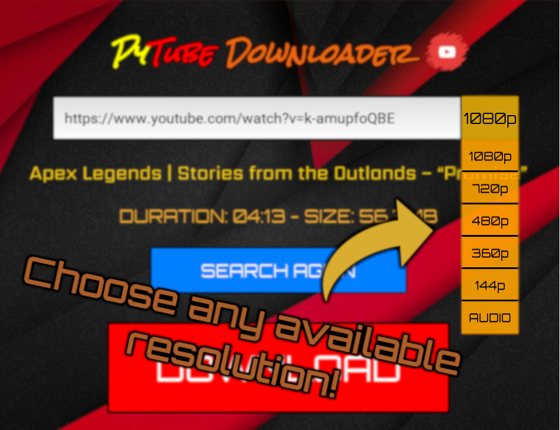
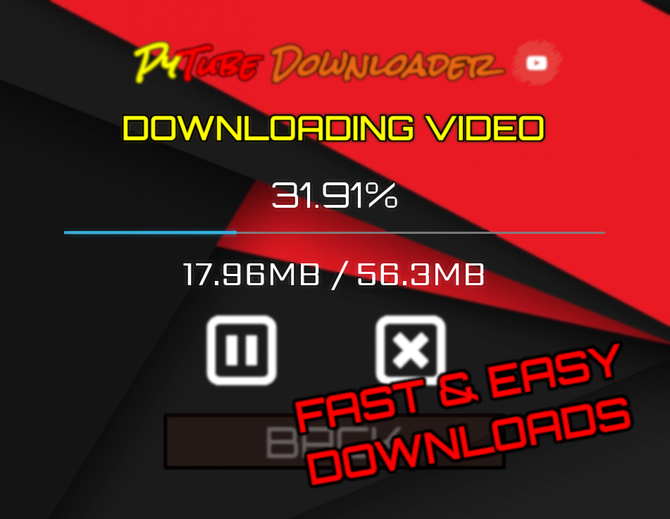

# PyTube Downloader - Youtube Downloader with Python!





## Information
Tired of all these ads and popups appearing on your screen when trying to download a YouTube video?\
Check out PyTube Downloader! No more tedious advertisements popping everywhere, just a simple and easy solution to your problems!\
PyTube Downloader, with its intuitive GUI and the pytube library, is able to detect every YouTube video from its URL and download them in any available resolutions and more!

## Usage
Simply <a href="https://mega.nz/file/4L5VQCwL#YTjAW-A_PP9q97sUHsmqBHnPG4fV0BDkaGnGOI8XBb0" target="_blank">download</a> and open the executable file (recommended) or install all the dependencies and execute the main.py script.\
*FFmpeg is required in order to download videos. Be sure to <a href="https://www.wikihow.com/Install-FFmpeg-on-Windows" target="_blank">install it and have it added to PATH</a>!*\
To download a video, just copy and paste the URL of the video you want in the text field and click on the search button.\
Choose your desired resolution and simply click the download button! It's easy as that, without annoying popups!
Check the <a href="https://youtu.be/oWKE2u6k6zA" target="_blank">video tutorial</a>!

## Download
https://mega.nz/file/4L5VQCwL#YTjAW-A_PP9q97sUHsmqBHnPG4fV0BDkaGnGOI8XBb0 (.exe file, 17.6 MB)

## Dependencies
Install all the dependencies by typing ```pip install -r requirements.txt``` or by individually installing each one of them listed below.\
Ensure you have the latest pip and wheel by typing ```pip install --upgrade pip wheel setuptools```

- Pytube3
- <a href="https://kivy.org/doc/stable/installation/installation-windows.html" target="_blank">Kivy</a>
- EasyGUI

**_Note: you might encounter issues with the pytube library. I had to manually modify some files inside the pytube3 directory to make it work. To avoid all of this, download the executable file!_**

## Notes
This project was developed by me in the span of two weeks. Hope you enjoy it!\
Any feedback is really appreciated, along with pull requests and issues requests!\
Feel free to contact me for any issue! :blush:\
Don't forget to :star: this repository if you liked it!
